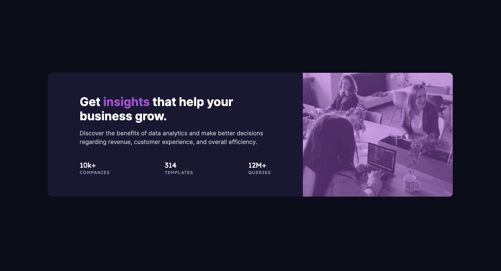

# Frontend Mentor - Stats preview card component solution

This is a solution to the [Stats preview card component challenge on Frontend Mentor](https://www.frontendmentor.io/challenges/stats-preview-card-component-8JqbgoU62). Frontend Mentor challenges help you improve your coding skills by building realistic projects. 

## Table of contents

- [Overview](#overview)
  - [The challenge](#the-challenge)
  - [Screenshot](#screenshot)
  - [Links](#links)
- [My process](#my-process)
  - [Built with](#built-with)
  - [What I learned](#what-i-learned)
  - [Continued development](#continued-development)
  - [Useful resources](#useful-resources)
- [Author](#author)

## Overview

### The challenge

Users should be able to:

- View the optimal layout depending on their device's screen size

### Screenshot



### Links

- [Solution URL](https://www.frontendmentor.io/solutions/pure-htmlcss-with-flexbox-and-media-queries-WrkLKxFpu)
- [Live Site URL](https://skyebrownh.github.io/stats-preview-card/)

## My process

### Built with

- Semantic HTML5 markup
- CSS custom properties
- Flexbox
- Mobile-first workflow

### What I learned

A few concepts I learned from this challenge:
- Using media queries to conditionally display an image

```html
<div class="img-wrapper">
  
  
</div>
```

```css
.desktop-img {
  display: none; /* hide desktop image on mobile */
}

@media (min-width: 1024px) {
  .mobile-img {
    display: none; /* hide mobile image on desktop */
  }

  .desktop-img {
    display: inline-block; /* unhide desktop image */
  }
}
```

- Using `vertical-align` with inline-block elements

```css
.some-inline-block-element {
  vertical-align: middle; /* functions similarly to align-items in a flexbox row */
}
```

- Targeting element corners for `border-radius`

```css
.some-element {
  border-top-left-radius: 10px;
  border-top-right-radius: 10px;
  border-bottom-left-radius: 10px;
  border-bottom-right-radius: 10px;
}
```

- Targeting all child elements (can be different tags) within a parent element

```css
.parent-element > * {
  /* styles for all children */
}
```

### Continued development

In the future, I will focus on creating a more fluidly responsive design instead of just focusing on 1 or 2 breakpoints.

### Useful resources

- [Select all child elements recursively (Geeks for Geeks)](https://www.geeksforgeeks.org/how-to-select-all-child-elements-recursively-using-css/) - Use this selector to target all child elements of a parent, regardless of tag.
- [Use media queries to swap images (Stack Overflow)](https://stackoverflow.com/questions/27853884/media-queries-and-image-swapping/27853917) - Use media queries to conditionally show & hide images for various screen sizes.
- [CSS Vertial Align (CSS Tricks)](https://css-tricks.com/almanac/properties/v/vertical-align/) - How `vertical-align` works and should be used.

## Author

- Frontend Mentor - [@skyebrownh](https://www.frontendmentor.io/profile/skyebrownh)
- Twitter - [@skyebrownh](https://www.twitter.com/skyebrownh)
- GitHub - [@skyebrownh](https://www.github.com/skyebrownh)